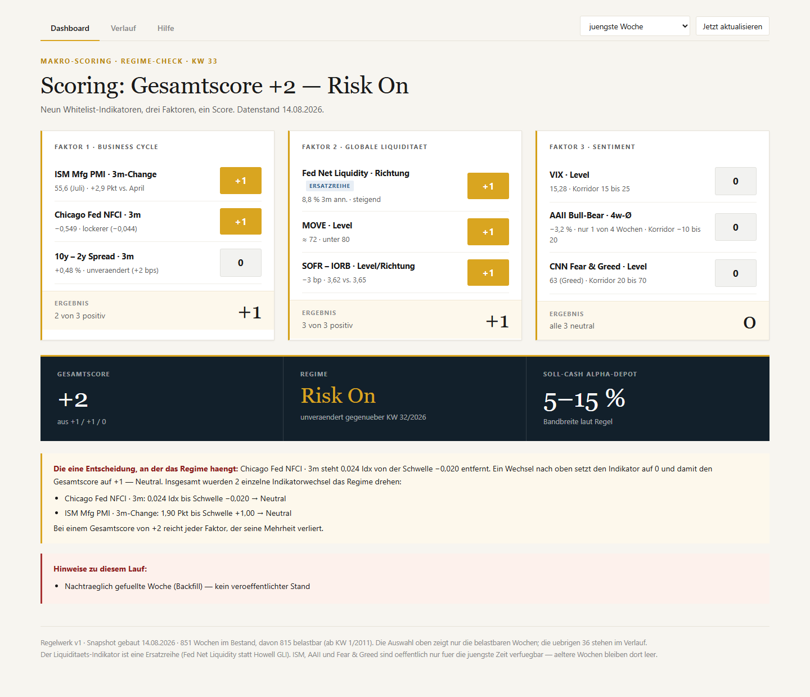
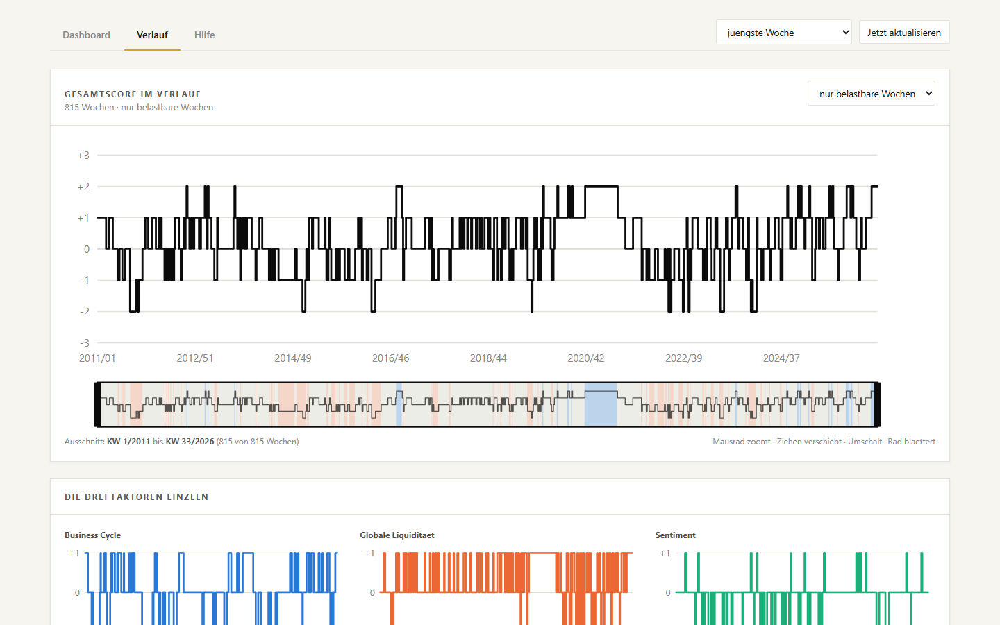
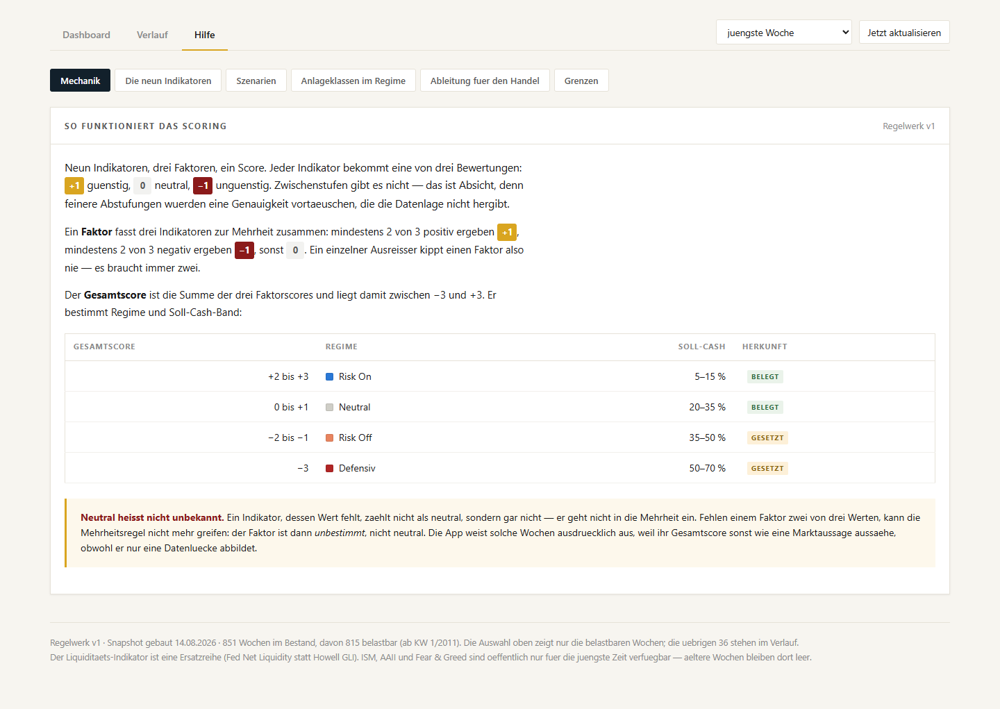

# Makro-Scoring · Regime-Check

Lokale Browser-App: neun Whitelist-Indikatoren → drei Faktoren → ein Gesamtscore → Regime und
Soll-Cash-Band. Jeder Wochenstand wird als Snapshot aufbewahrt, damit sich Veränderungen von
Kalenderwoche zu Kalenderwoche und von Jahr zu Jahr verfolgen lassen.

Vorlage der Methodik und Gestaltung: `doc/MakroScoringInfoScreen.jpg` (KW 32/2026).
Idee stammt aus Videos von: https://www.youtube.com/@balthasarbecker

## Screenshots

**Dashboard** — Gesamtscore, die drei Faktoren mit ihren neun Indikatoren und der Grenzfall, der
das Regime am ehesten kippt:



**Verlauf** — Score-Historie mit Zoom/Pan und Übersichtsleiste, darunter die drei Faktoren einzeln:



**Hilfe** — Methodik, Schwellen und Regime-Bänder direkt aus `rules/v1.json` gerendert:



## Loslegen

```bash
npm install
```

```bash
npm run update
```

```bash
npm run dev
```

Dann `http://localhost:5177` öffnen. `npm run dev` startet API-Server (Port 5178) und Frontend
(Port 5177) gemeinsam.

Weitere Befehle:

```bash
npm run check:sources
```

```bash
npm run backfill
```

```bash
npm test
```

## Die Methodik

| Faktor | Indikatoren |
|---|---|
| 1 · Business Cycle | ISM Mfg PMI (3m-Change) · Chicago Fed NFCI (3m) · 10y−2y Spread (3m) |
| 2 · Globale Liquidität | Howell GLI (Richtung) · MOVE (Level) · SOFR−IORB (Level/Richtung) |
| 3 · Sentiment | VIX (Level) · AAII Bull-Bear (4w-Ø) · CNN Fear & Greed (Level) |

Jeder Indikator wird zu −1 / 0 / +1. Ein Faktor ist +1, wenn mindestens zwei seiner drei
Indikatoren positiv sind, −1 bei zwei negativen, sonst 0. Der Gesamtscore ist die Summe der drei
Faktoren (−3 … +3) und bestimmt Regime und Soll-Cash-Band.

Alle Schwellen stehen in `rules/v1.json`, nichts davon ist im Code fest verdrahtet. Jeder Snapshot
merkt sich, mit welcher Regelwerk-Version er gerechnet wurde — eine Regeländerung bekommt eine neue
Datei, alte Snapshots bleiben reproduzierbar.

## Datenquellen

| Indikator | Quelle | Historie |
|---|---|---|
| Chicago Fed NFCI | FRED `NFCI` | ab 1971 |
| 10y−2y Spread | FRED `T10Y2Y` | ab 1976 |
| VIX | FRED `VIXCLS` | ab 1990 |
| SOFR − IORB | FRED `SOFR`, `IORB` + `IOER` verkettet | ab 2018 |
| Liquidität (Ersatz) | FRED `WALCL` − `WTREGEN` − `RRPONTSYD` | ab 2002 |
| MOVE | Yahoo `^MOVE` | ab 2002 |
| CNN Fear & Greed | CNN dataviz-Endpunkt | ~1 Jahr live, optional ab 2011 nachladbar |
| ISM Mfg PMI | PRNewswire-Pressemitteilungen | ~12 Monate |
| AAII Bull-Bear | aaii.com: Ergebnistabelle (~22 Wochen je Abruf) + offizielle Arbeitsmappe | ab Juli 1987, einmalig nachzuladen |

FRED läuft über den CSV-Graphdienst und braucht **keinen API-Schlüssel**.

### Drei Einschränkungen, die man kennen muss

**1. Der Liquiditäts-Indikator ist eine Ersatzreihe.** Der Howell GLI (CrossBorder Capital) ist
kostenpflichtig und hat keine offene Schnittstelle. An seiner Stelle steht Fed Net Liquidity
(Fed-Bilanz − Treasury General Account − Reverse Repo). Gleiche Form, anderer Aggregatbegriff. Die
App kennzeichnet ihn überall als `ERSATZREIHE`.

Diese Reihe ist zudem deutlich unruhiger als das Original: ihre 3m-annualisierte Rate schwankt im
Monatsvergleich mit einer Standardabweichung von rund 50 Prozentpunkten. Die Schwelle wurde deshalb
an der Reihe selbst kalibriert (±6,0 pp, ergibt etwa eine Drittelung) statt geraten. Die Messung
steht in `rules/v1.json` unter `calibration`.

**2. Der ISM begrenzt die belastbare Historie.** Seine Pressemitteilungen geben öffentlich nur rund
12 Monate her. AAII und Fear & Greed lassen sich dagegen beide nachladen (siehe unten): mit beiden
Importen sind von 851 rückgerechneten Wochen ab 2010 **817 aussagekräftig** (ab KW 51/2010). Bei den
verbleibenden 34 Wochen ganz am Anfang der Reihe ist mindestens ein Faktor mangels Daten nicht
bestimmbar.

Diese Wochen werden nicht versteckt, aber auch nie wie ein regulärer Stand dargestellt: sie tragen
`completeness: "sparse"`, erscheinen im Verlauf schraffiert und fehlen in der Wochenauswahl. Der
Grund ist wichtiger als es aussieht — ein fehlender Indikator zählt rechnerisch als 0 und zieht den
Gesamtscore Richtung Mitte. Ohne Kennzeichnung läse man eine Datenlücke als „Neutral".

**3. Einzelne Schwellen sind gesetzt, nicht belegt.** Aus einem Screenshot lassen sich nicht alle
Regeln ableiten. Was belegt ist (VIX-Korridor 15–25, MOVE < 80, F&G 20–70, AAII −10…+20, die
Mehrheitsregel, Risk On bei +2 und Neutral bei +1), ist als solches vermerkt. Alles Übrige trägt
`"assumed": true` samt Begründung — insbesondere die numerischen Schwellen für ISM, NFCI und
Spread-Änderung, das Verhalten oberhalb der Sentiment-Korridore (kontrarisch gelesen) und die
Regime-Bänder für negative Gesamtscores.

### Optional: Historie für AAII und Fear & Greed nachladen

Zwei einmalige Importe, beide ohne Konto und ohne Schlüssel. Sie laufen **nicht** im regulären
`npm run update` mit: sie holen jeweils einen vergangenen, unveränderlichen Zeitraum, und der
Wochenbetrieb soll nicht an ihrer Erreichbarkeit hängen.

**AAII seit Juli 1987 — offiziell und kostenlos.**

```bash
npm run import:aaii
```

Die Mitgliedschaft (298 USD/Jahr) braucht es dafür nicht: AAII legt die vollständige Wochenhistorie
als Arbeitsmappe unter
[aaii.com/files/surveys/sentiment.xlsx](https://www.aaii.com/files/surveys/sentiment.xlsx) frei ab
— 2015 Wochen ab 1987-07-22, verlinkt von der öffentlichen Ergebnisseite. Gelesen wird sie mit
Bordmitteln (`node:zlib`), ohne Fremdbibliothek; eine `.xlsx` ist ein ZIP mit XML darin.

Zwei Details, die dabei zählen. Erstens datiert die Arbeitsmappe eine Umfrage auf den Tag der
Veröffentlichung (meist Donnerstag), die Website auf den Mittwoch ihres Schlusses — der Import
rechnet auf den Mittwoch um, sonst stünden für dieselbe Umfrage zwei Punkte im Cache. Zweitens hinkt
die Mappe der Website um Monate nach; die Lücke bis heute schließt der reguläre Wochenabruf aus der
Ergebnistabelle (~22 Wochen je Lauf). Beide Wege zusammen ergeben eine durchgehende Reihe: 2036
Wochen von 1987-07-22 bis heute, mit drei einzelnen ausgelassenen Wochen in 39 Jahren.

**Fear & Greed ab 2011 — rekonstruiert, nicht offiziell.**

```bash
npm run import:feargreed
```

Recherche vom 14.08.2026: CNN verkauft keine Historie seines Fear-&-Greed-Index, und kein
institutioneller Datenanbieter (Bloomberg, Refinitiv, FactSet, Trading Economics, Quandl) führt die
Reihe. Es gibt dafür nur eine kostenlose, MIT-lizenzierte Community-Rekonstruktion:
[github.com/whit3rabbit/fear-greed-data](https://github.com/whit3rabbit/fear-greed-data), täglich
seit 2011-01-03.

Wichtig: **der Autor der Quelle weist selbst darauf hin, dass Werte vor dem 01.02.2021 aus Archiven
rekonstruiert und weniger genau sind** als danach. Die App verschweigt das nicht — Wochen, die aus
dem Import stammen, tragen `quality: "proxy"` (dasselbe `ERSATZREIHE`-Badge wie beim GLI) und bei
Daten vor der Grenze einen zusätzlichen Hinweis in der Anzeigezeile. Die echte CNN-Live-Quelle hat
für jede Woche, die sie abdeckt, immer Vorrang. Dieser Vorbehalt gilt nur hier: die AAII-Mappe
stammt vom Umfrageveranstalter selbst und trägt kein solches Kennzeichen.

Nach beiden Importen rechnet `npm run backfill -- --no-fetch` die betroffenen historischen
Snapshots neu.

Warum das so viel bringt: ein Faktor gilt als bestimmbar, sobald 2 von 3 Mitgliedern einen Wert
haben. NFCI und Zinskurve sind immer da, GLI und MOVE fast immer — Business Cycle und Liquidität
sind damit historisch fast durchgehend bestimmbar, auch ganz ohne ISM oder SOFR-Vorgeschichte.
Einzig Sentiment war blockiert, weil AAII und Fear & Greed gleichzeitig fehlten und VIX allein nicht
reicht. Schon ein nachgerüsteter Datensatz macht die Wochen aussagekräftig; mit beiden ist der
Sentiment-Faktor über den ganzen Bestand hinweg vollständig besetzt statt auf zwei von drei
Mitgliedern gestützt — und damit sind die Szenarien rund um Stimmungsextreme überhaupt erst
historisch prüfbar.

## Aufbau

```
data/snapshots/<jahr>/<jahr>-W<kw>.json   git-versioniert — das Gedächtnis
data/series/                              Rohdaten-Cache (nicht versioniert)
rules/v1.json                             Schwellen, Korridore, Regime-Bänder
src/core/                                 Scoring, Szenarien, ISO-Wochen, Ableitungen (ohne I/O)
src/sources/                              ein Konnektor je Quelle
src/pipeline/                             Snapshot-Bau, Store, Vergleiche, Szenario-Backtest
src/server/                               API + Proxy zu den Quellen
web/                                      Dashboard, Verlauf und Hilfe
web/src/content/                          Erklärtexte; playbooks.ts ist gesetzt, nicht abgeleitet
test/                                     196 Tests, davon der Golden Test
```

**`src/core/` ist frei von Datei- und Netzzugriff.** Dieselbe Scoring-Logik läuft im ETL, im Server
und im Browser — ohne Duplikat.

**Snapshots sind unveränderlich und enthalten keine Deltas.** Wochen- und Jahresvergleiche werden
beim Lesen gerechnet. Wären sie eingebacken, müsste jeder Nachtrag alle Folgewochen umschreiben.
Geschrieben wird mit stabiler Schlüsselreihenfolge, sodass ein Wochenlauf einen lesbaren `git diff`
erzeugt: bei unveränderten Daten ändert sich genau eine Zeile, nämlich `builtAt`.

**Warum ein lokaler Server statt einer statischen Seite:** FRED, Yahoo, CNN und AAII senden keine
CORS-Header. Eine reine Browser-App kann sie nicht abrufen.

## Der Hilfe-Tab

Erklärt jeden Indikator einzeln, was Veränderungen bedeuten, wie sich das Gesamtbild zusammensetzt
und was sich ableiten lässt. Zwei Regeln bestimmen seinen Bau:

**Keine zweite Wahrheit.** Sämtliche Schwellen, Korridore und Cash-Bänder werden aus
`rules/v1.json` und dem aktuellen Snapshot gerendert — auch die Skalenleiste unter jedem Indikator
und die Liste der elf gesetzten Annahmen. Verschiebt jemand eine Schwelle, bewegt sich die Hilfe
mit. Von Hand geschrieben ist nur, was sich nicht aus den Daten ergibt: was ein Indikator misst und
warum er im Modell steckt.

Beim Bau fiel dabei eine bestehende Doppelung auf: die Sentiment-Korridore standen zusätzlich als
Text in den Anzeigezeilen (`"Korridor 15–25"`). Sie kommen jetzt ebenfalls aus dem Regelwerk, und
ein Test hält das fest.

**Die Szenarien werden gerechnet, nicht behauptet.** Vier Durchspielungen laufen von der gewählten
Woche aus durch `aggregateFactor()` und `resolveRegime()` — denselben Code, der die Snapshots
erzeugt. Das geht nur, weil `src/core/` frei von I/O ist.

Die Aufteilung folgt der Frage, ob etwas Eingabe einer Rechnung ist: die Annahmen — welcher
Indikator auf welchen Score gesetzt wird — stehen in `src/core/scenario.ts`, wo auch der Server sie
für den Backtest liest. Titel, Auslöser und Einordnung bleiben in `web/src/content/help.ts`. Ein
`Record<ScenarioId, ScenarioText>` erzwingt, dass zu jedem Szenario ein Text existiert; ein
vergessener Eintrag ist ein Typfehler, kein leerer Kasten.

Bis dahin gab es die Rechnung **zweimal**: einmal im Hilfe-Tab und einmal als Nachbau im Test. Genau
das hatte einen Fehler verdeckt. `aggregateFactor()` ignoriert Indikatoren mit
`quality: "missing"` — der Nachbau setzte beim Override aber nur den Score, nicht die Qualität. Ein
Szenario, das einen fehlenden Indikator annimmt, blieb damit **wirkungslos**, während die Anzeige
eine Bewegung behauptete. Bei „Sentiment kippt in Extreme Greed" traf das damals 814 von 815 Wochen — AAII trug nur die
laufende. Jetzt
setzt der Override auch die Qualität, und die Kachel weist aus, dass der Wert *angesetzt* und nicht
*bewegt* wird.

### Szenarien im Dashboard

Unter dem Grenzfall-Kasten steht dieselbe Rechnung in Kurzform: pro Szenario die bewegten
Indikatoren, der Gesamtscore vorher/nachher und das Regime-Ergebnis. Auslöser und Einordnung bleiben
der Hilfe vorbehalten, ein Verweis springt dorthin. Die Begründung für die Platzierung ist
inhaltlich: der Grenzfall-Kasten ist das *Ein*-Indikator-Was-wäre-wenn, die Szenarien sind dessen
*Zwei*-Indikatoren-Pendant. Beide erscheinen nur bei belastbarer Lage — eine Durchspielung aus einem
Stand ohne Aussage hat selbst keine.

Beide Ansichten rechnen von der **gewählten** Woche aus. Die Wochenauswahl im Dashboard zieht sie
mit; jede der 817 belastbaren Wochen lässt sich so durchspielen.

Ein Abschnitt fällt bewusst aus dem Rahmen: die Einordnung je Anlageklasse in
`web/src/content/playbooks.ts`. Das Regelwerk leitet aus dem Regime ausschließlich das
Soll-Cash-Band ab; alles zu Aktien, Stil, Duration und Credit ist gesetzt. Deshalb steht es in einer
eigenen Datei, ist in der Oberfläche grau abgesetzt statt golden und trägt den Vermerk, dass es
nicht aus dem Modell stammt.

## Anlageklassen im Regime

Unter dem Score-Verlauf liegt ein zweites Diagramm mit den Kursverläufen von elf Anlageklassen,
einzeln zuschaltbar, auf 100 zum Fensterbeginn indexiert. Beide Felder teilen sich Breite, Ränder
und Zeitachse aus `web/src/components/chartGeometry.tsx` und tragen dieselbe Regime-Schattierung —
nur so lässt sich senkrecht ablesen, was eine Anlageklasse während einer Regime-Phase getan hat.

Bewusst **keine zweite y-Achse**: Score −3…+3 und Kursindex auf einer Fläche ließen sich so
skalieren, dass dieselbe Datenlage nach Gleichlauf oder nach Gegenlauf aussieht.

### Zoomen und Blättern

Über 800 Wochen ergeben rund einen Bildpunkt je Woche — lesbar wird das erst im Ausschnitt.
Mausrad zoomt (ankertreu: die Woche unter dem Zeiger bleibt stehen), Ziehen verschiebt,
Umschalt+Rad blättert. Unter den Diagrammen liegt eine Übersichtsleiste mit dem gesamten Bestand
und dem sichtbaren Fenster als verschiebbarem Rahmen mit zwei Griffen.

Der Ausschnitt ist ein `slice()` auf die Datenreihe **vor** der Übergabe an die Diagramme — die
Zeichenlogik von `ScoreChart`, `FactorCharts` und `AssetOverlay` blieb dafür unverändert. Die
Fenster-Mathematik steht als reines Modul in `web/src/components/windowMath.ts` und ist ohne DOM
testbar (`test/window-math.test.ts`).

Zwei Kopplungen sind Absicht: Score- und Kursdiagramm teilen sich **ein** Fenster (sonst wäre der
senkrechte Vergleich wertlos), und die Regime-Heatmap zoomt **nicht** mit — sie ist die
Gesamtsicht. Beim Zoomen wird der Kursindex auf den ersten sichtbaren Punkt neu gesetzt, damit
sich die 100er-Linie nicht auf eine Woche außerhalb des Bildes bezieht.

### Gemessen wird die Folgewoche

Das Regime der Woche *W* steht erst an deren Ende fest. Die Rendite derselben Woche zuzuordnen wäre
ein Blick in die Zukunft und würde jede Kennzahl schönrechnen. Gemessen wird deshalb *W+1* — der
Ertrag, den man tatsächlich hätte erzielen können. `test/asset-returns.test.ts` hält das fest.

Gerechnet wird auf `adjclose`, also inklusive Ausschüttungen. Ohne das wären TLT, HYG und LQD
systematisch schlechtgerechnet, weil dort der Kupon den Großteil der Rendite ausmacht.

### Vergleichsmodell 2018

Ursprünglich hatte das echte Modell nur 53 belastbare Wochen — Risk Off kam darin **zweimal** vor,
für eine Auswertung war das nichts. Deshalb gibt es einen zweiten Modus, der nur mit den sechs
historisch durchgehend verfügbaren Indikatoren rechnet und bis Juli 2018 zurückreicht (**420
Wochen**, einschließlich Corona-Crash und 2022). Bindende Grenze ist der SOFR ab April 2018.

Die beiden optionalen Importe (siehe oben) haben diesen Engpass inzwischen behoben: das echte
Modell deckt jetzt **817 Wochen** ab (KW 51/2010 bis heute) — mehr als das Vergleichsmodell. Es
bleibt trotzdem nützlich, aber aus einem anderen Grund: als unabhängige Gegenprobe mit einer
bewusst anderen, schmaleren Methodik, die nicht am optionalen Import hängt und auch ohne ihn
sofort läuft.

Das ist **eine andere Methodik, nicht die Verlängerung des echten Modells**: der Sentiment-Faktor
besteht dort allein aus dem VIX, der Business-Cycle-Faktor nur aus NFCI und Zinskurve. Die Mehrheit
bezieht sich auf die vorhandenen Werte (`aggregateFactor(..., 'available')`), was bei drei
vorhandenen Werten rechnerisch dasselbe ergibt wie die echte Regel — `test/aggregation-mode.test.ts`
prüft das über alle 27 Kombinationen. Das Vergleichsmodell wird **nie gespeichert**, sondern bei
Bedarf aus dem Rohdaten-Cache gerechnet.

### Warum jede Zahl ihre Stichprobe mitführt

Die Tabelle zeigt neben jeder Kennzahl die Zahl der Wochen **und der Episoden**. Der Grund steht im
Ergebnis selbst: im Vergleichsmodell stammen 58 der 73 Risk-On-Wochen aus zwei Phasen 2020/21. Ohne
2020 halbiert sich die Kennzahl (+56,9 % → +28,4 %). `n = 73` sieht robust aus, sind aber im Kern
zwei Beobachtungen desselben Ereignisses — solche Zellen tragen deshalb einen Stern.

Unter acht Wochen erscheint gar keine Zahl, sondern „zu wenige Daten". Im echten Modell bleibt die
Risk-Off-Spalte damit leer.

## Der Golden Test

`test/golden.test.ts` füttert die neun Werte aus der Vorlage in den Scoring-Kern und erwartet exakt
das dort abgedruckte Ergebnis: Einzelscores `+1,+1,0 / −1,+1,+1 / 0,0,0`, Faktoren `+1,+1,0`,
Gesamtscore `+2`, Regime `Risk On`, Cash `5–15 %`.

Er prüft zusätzlich beide Punkte des roten Kastens der Vorlage: dass der VIX 0,15 Punkte über seiner
Complacency-Schwelle steht, und dass ein Kippen von SOFR−IORB den Gesamtscore auf +1 und damit das
Regime auf Neutral zieht. Schlägt dieser Test fehl, ist jede andere Zahl der App wertlos.

Nebenbefund beim Schreiben: bei einem Gesamtscore von genau +2 kippen **vier** Indikatoren das
Regime, nicht nur die zwei genannten — jeder Faktor, der seine Mehrheit verliert, reicht. Die
Vorlage hebt SOFR−IORB und VIX hervor, weil sie ihren Schwellen am nächsten stehen.

## Grenzfall-Analyse

Die App berechnet für jeden Indikator den Abstand zur nächsten Schwelle und spielt durch, welcher
einzelne Wechsel das Regime dreht — die maschinelle Fassung des roten Kastens.

Die Rangfolge läuft dabei **nicht** über den rohen Abstand: 3 bp beim SOFR-Spread, 0,01 Indexpunkte
beim NFCI und 1,9 Punkte beim ISM messen völlig verschiedene Dinge. Verglichen wird in
Standardabweichungen der eigenen Wochenveränderung, sobald genug Historie vorliegt, sonst in
Schritten der Anzeigegenauigkeit.

## Backtest der Szenarien

`GET /api/scenarios` wertet aus, wie oft die von einem Szenario angenommene Lage im Bestand
**tatsächlich vorlag** — und was danach kam. Drei Punkte, die man nicht raten können soll:

**Gezählt wird, wann diese Lage galt — nicht, wie wahrscheinlich sie ist.** Der Hilfe-Tab legt ein
Szenario kontrafaktisch auf die gewählte Woche („was wäre, wenn"); der Backtest zählt Vorkommen
(„wann war es so"). Die beiden Zahlen stehen nebeneinander und dürfen nicht zu einer Quote verrechnet
werden. Deshalb ist der Endpunkt auch wochenunabhängig und wird einmal beim Start geladen, nicht bei
jedem Wochenwechsel.

**Ein fehlender Wert erfüllt keine Annahme.** Fehlende Indikatoren stehen im Snapshot mit Score 0 —
ohne Qualitätsprüfung erfüllte jede Datenlücke einen Override auf 0. Das ist der Grund, warum drei
von vier Szenarien eine ehrliche Null zeigen, und warum daneben steht, woran es liegt:

| Szenario | Vorkommen | Bindender Engpass |
|---|---|---|
| Liquiditätsimpuls dreht ab | 53 von 817 (27 Episoden), zuletzt KW 36/2025 | MOVE: in 165 Wochen bei −1 |
| Sentiment kippt in Extreme Greed | 29 von 817 (11 Episoden), zuletzt KW 42/2024 | AAII: in 87 Wochen bei −1 |
| Konjunktur bricht ein | 0 | ISM trägt erst in 42 von 817 Wochen einen Wert |
| Funding-Stress | 0 | SOFR−IORB war in 13 Wochen bei −1 |

Der Engpass geht nach der Zahl der *zutreffenden* Wochen, nicht nach der Abdeckung: der SOFR-Spread
hat 437 Wochen mit Wert, stand darin aber nur 13-mal auf −1. Ein gemeinsames Vorkommen kann nie
häufiger sein als die seltenste Einzelannahme.

Die zweite Zeile war lange die aussagekräftigste Illustration des Gegenteils: solange AAII nur die
laufende Woche trug, stand dort eine Null, die nach einem Marktbefund aussah und in Wahrheit die
Datenlage beschrieb. Erst mit der importierten Historie wird daraus eine Aussage.

**Der Vorwärtsblick ist kalenderbasiert.** 4, 13 und 26 Wochen später wird über `addIsoWeeks`
nachgeschlagen, nicht über einen Array-Index — 2020 und 2026 haben 53 Wochen, und ein einziger
ausgefallener Wochenlauf ließe eine Indexrechnung still verrutschen. Fehlt die Zielwoche am
Reihenende, zählt sie als `truncated` und wird ausgewiesen; sie stillschweigend aus dem Nenner zu
nehmen würde das Ergebnis schönen.

Und wie überall gilt der Backfill-Vorbehalt: der Bestand ist rückgerechnet. Er zeigt, wie das Modell
die Lage gesehen *hätte*, nicht wie es sie gesehen hat.

## Diagramme

Die Farben sind mit dem Validator der `dataviz`-Vorgaben geprüft. Die naheliegende Ampel
Grün/Gelb/Rot für die Regime ist dabei durchgefallen: Rot gegen Grün liegt bei Deuteranopie bei
einem Abstand von 4,1 und wäre in einer Heatmap mit angrenzenden Zellen nicht unterscheidbar. Die
Regime sind ohnehin geordnet und stehen deshalb auf einer divergierenden Skala mit neutraler Mitte.
Jede Zelle trägt zusätzlich ihre Zahl — Farbe trägt die Bedeutung nie allein.

## Nächste Schritte

- Die als `"assumed": true` markierten Schwellen gegen das Original-Regelwerk prüfen
- Export des Dashboards als PNG/PDF
- Was-wäre-wenn-Regler für die Schwellen (läuft im Browser, weil `src/core` I/O-frei ist)
- Szenarien mit eigenen Annahmen im Browser zusammenstellen — `applyScenario()` nimmt jede
  Override-Kombination entgegen, es fehlt nur die Bedienung
- Wochen-Automatik über die Windows-Aufgabenplanung
- Eine belastbare ISM-Historie bleibt offen — sie ist der letzte Begrenzer des Bestands

